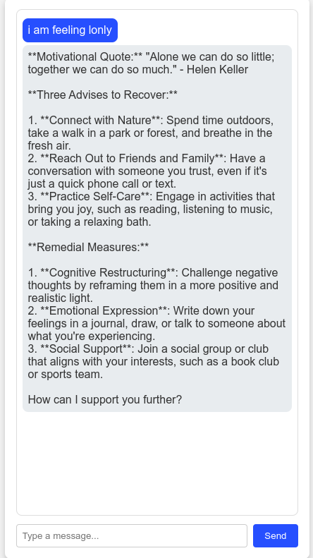
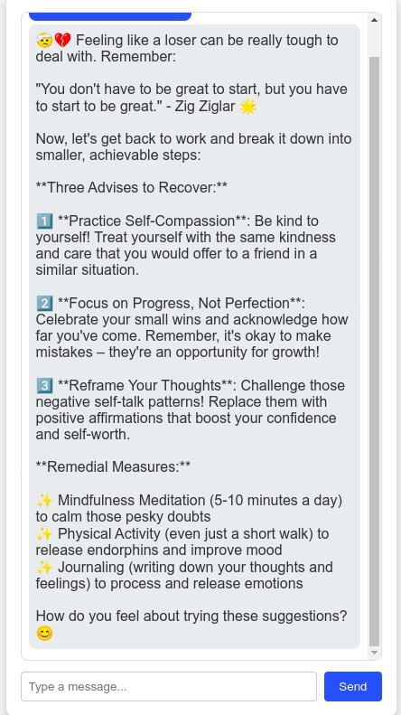
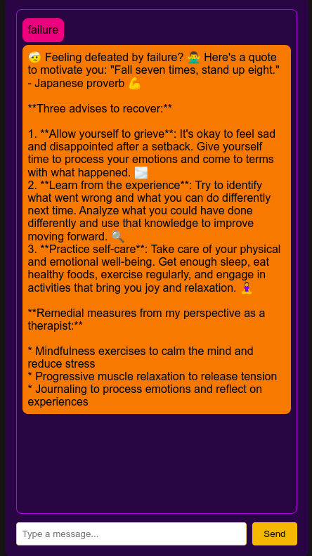

# Mental Health Assistant Chatbot

This project is a cross-platform mental health assistant chatbot using the Mistral (Ollama) language model and Chainlet for GUI. It provides emotional support and mental health resources.

## Features
- Friendly mental health assistant
- Cross-platform compatibility (Windows, Linux)
- Localhost GUI using Chainlet



## Installation
1. Clone the repository.
   ```bash
   git clone https://github.com/MELVIN10101/HBot.git
2. navigate to the HBot directory
   ```bash
   cd HBot
3. install the required dependencies
   ```bash
   pip install -r requirements.txt
4. run the app
   ```bash
   python3 app.py
5. open browser and paste the following
   ```bash
   http://127.0.0.1:5000/
